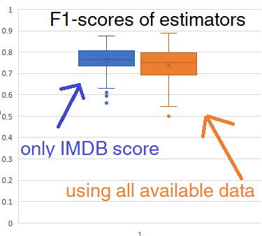

Predict My Movie Rating
=======================


Predict if I will find a movie worthwhile to watch.
Depending on how the data is split, the f1-score goes from 0.6 to 0.9.

Intuitively, I check if the IMDB score to guess if I would like the movie, but it does not always work. Can data analysis work?

I used Spark to learn the framework. Otherwise, I would use Pandas or Tableau. I used Excel for initial data exploration.

I downloaded my 120 IMDB ratings as CSV. Filtering out series and also movies without meta score, I still had 103 movies. 79 of them I consider good ones.

Training a small decision tree already gave good estimations.
A typical tree looks like this:
```
If (feature 0 <= 7.75)
 If (feature 1 <= 129.5)
  Predict: 1.0
 Else (feature 1 > 129.5)
  Predict: 0.0
Else (feature 0 > 7.75)
 If (feature 3 <= 61.5)
  Predict: 0.0
 Else (feature 3 > 61.5)
  Predict: 1.0
```
Feature 0 is the IMDB score, feature 1 is the movie length and feature 3 is the metacritic score.

Many of the trained decision trees took the IMDB score as the most important parameter.
Even a small decision tree overfits on the data. I got better results when training only using the IMDB score without the other categories. Shown in the following image:



Further steps
-------------
While the estimation works, the machine learning approach does not help much. Maybe estimator could be made by first doing an unsupervised clustering of the movies, users, and their rating. The current user could then be found mapped in this cluster and so a more personalized rating could be guessed.

For now, I'll keep using that score to guess if the movie is worthwhile to watch! 🎉

Disclaimers:
- IMDB score is probably inaccurate on movies that just came out.
- Do not use this project, it was just to learn the framework!
